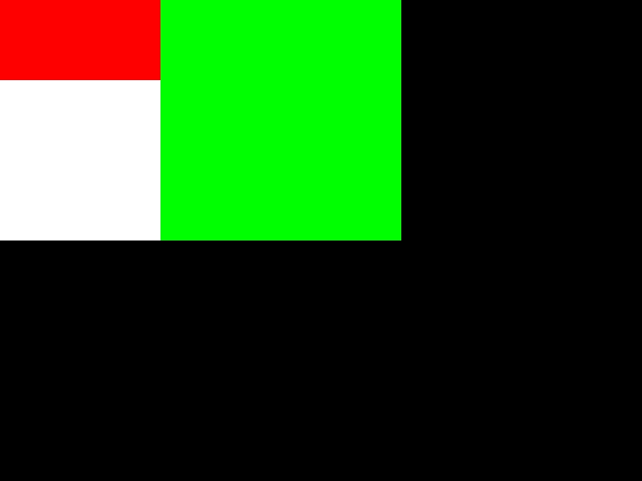

# 每周总结可以写在这里

## 本周作业
- [x] 实现`toy-browser` 

###  遇到的问题
1. images 插件 启动报错，
```bash
throw new Error(errors.unsupportedEnvironment());
      ^
Error: imagesdoes not yet support your current environment: OS X 64-bit with Unsupported runtime (72)
```
解决方法：使用node 10版本，可以通过`nvm use 10`切换版本，重新下载`images`插件，重新启动代码。
2. 红色的div无法渲染出来

刚刚开始红色的div一直渲染不出来，最后才发现在写rgb值时加了空格，在读取的时候也没有做任何的操作。background-color:rgb(255,0,0);写成了 background-color:rgb(255, 0, 0); 这是我平时的书写习惯问题造成了我踩坑。

从中也体会到了如果仅仅是照着截图写代码，当遇到问题的时候很难定位到问题，刚刚开始可以先照着实现出来效果，然后回过头去进行调试，打断点等操作，有空的时候再回过头去看看老师讲的视频。

分析`toy-browser`文件夹中的`output.json`，渲染元素,`output.json`的数据来自`parser`解析`html`后的内容。
```js
render(viewport, dom.children[0].children[3].children[1].children[1]); // 渲染红色div
render(viewport, dom.children[0].children[3].children[1].children[3]); // 渲染单个元素（绿色div）
render(viewport,dom); //渲染多个元素
 
```
layout代码错误
3. VSCode 调试
```bash
nvm alias default 10
```
## 相关网址
- https://www.w3.org/TR/2011/REC-CSS2-20110607

## 课堂笔记
2020-05-21
2020-05-23
### flex
- 主轴 和 交叉轴
在开发`flutter`时，也用到了`flex`布局，实现`layout.js`帮助理解了`layout`的实现原理

## 心得与体会
通过自己写`toy-browser`,模拟浏览器的渲染过程，
URL(HTTP)=>HTML(parse解析)=>DOM(CSS computing计算)=>DOM with CSS(layout)=>DOM with position(render)=>Bitmap(位图)
。用`images`插件生成图片，渲染出来的样式和在浏览器中渲染的一模一样就说明`toy-browser`实现成功啦。
纯色渲染使用`render`比较简单